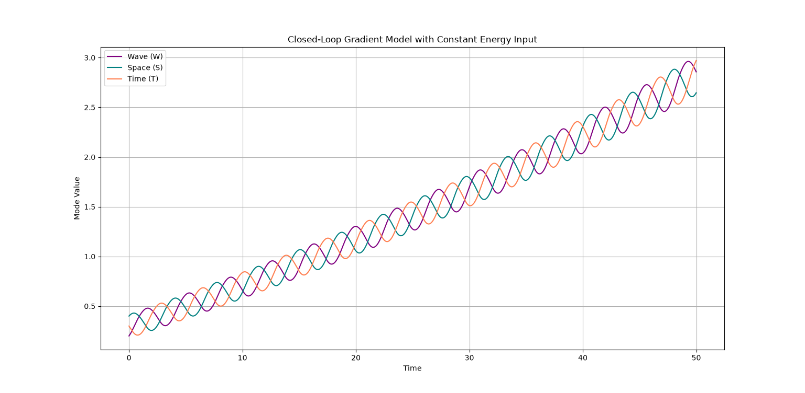

# 🌀 Axiomatic-Hierarchical-Generation (W-S-T Uroboros Model)

[](https://zenodo.org/records/21819444)


A minimal numerical realization of the **General Theory of Hierarchical Generation**. This repository contains the source code for the **W-S-T (Wave-Space-Time) Closed-Loop Gradient Model**, demonstrating self-referential emergence and autonomous scale-expansion.

> **"Calculus is not just a horizontal tool for continuous spaces; it is a vertical elevator for shifting across distinct hierarchical dimensions."**

---

## 📈 Autonomous Self-Organization (Simulation Result)



When running this code, the three fundamental modes—**Wave (W)**, **Space (S)**, and **Time (T)**—feed into each other's gradients in a self-referential loop (an Uroboros structure). Even without explicit external growth factors, the system internally generates a **stable, expanding spiral trajectory**, breaking through predefined saturation limits.

---

## 🧠 Core Theoretical Architecture

This model is mathematically grounded in the core axioms of the general theory:

1. **Natural Scale ($S_n$):** 
   $$S_n = \left\| \frac{\partial H_n}{\partial \lambda_n} \right\|$$
   The internal rate of change itself creates the metric of the hierarchy.
2. **Hierarchical Generation:** 
   $$H_{n+1} = \frac{\partial H_n}{\partial S_n}$$
   Moving upward to the next abstract layer is formulated as scale-normalized differentiation.
3. **Dissipation / Structural Memory ($R_n$):** 
   $$R_n = H_n - S_n H_{n+1}$$
   The residual component that cannot be absorbed by the upper layer precipitates as latent memory (e.g., material stress, organizational culture, or the cognitive unconscious).

---

## 🛠️ Getting Started

### Prerequisites
- Python 3.x
- NumPy
- Matplotlib

### Execution
Simply clone the repository and run the simulation script to witness the self-referential phase evolution:

```bash
git clone https://github.com
cd Axiomatic-Hierarchical-Generation
python wst_simulation.py
```

## 🚀 Future Horizons & Contributions
This toy model serves as the foundational mathematical baseline. We are currently tuning this closed-loop system toward:

Concrete connections to existing physics (e.g., wave–space–time–particle–information hierarchies)
Applications to generative models of cosmic origin (the emergence of the universe)
Hierarchical approaches toward a unified theory of forces
Applications to neural networks and generative AI
Applications to complex hierarchical systems (such as cognition, language, and life)

Feel free to fork, experiment with parameters (e.g., `input_energy`, `grad_weight`), and explore the boundaries where this beautiful order collapses into chaos or shifts into higher dimensions.

---
**Author:** Independent Researcher  
**Full Abstract Paper:** Accessible via the Zenodo DOI badge above.
