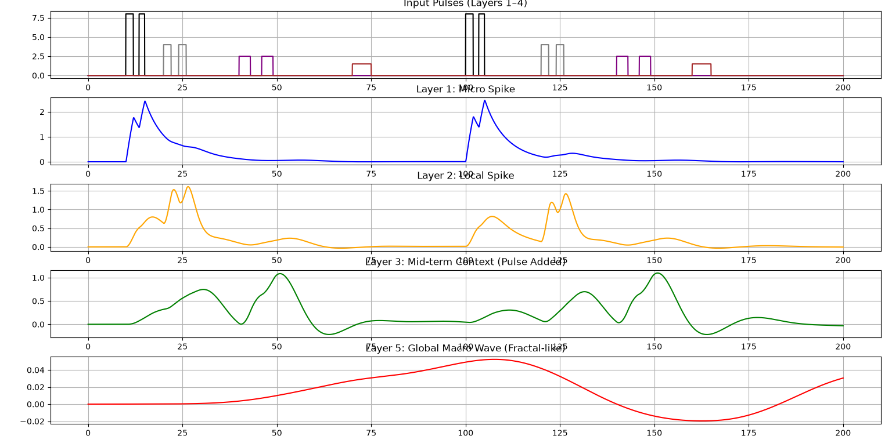
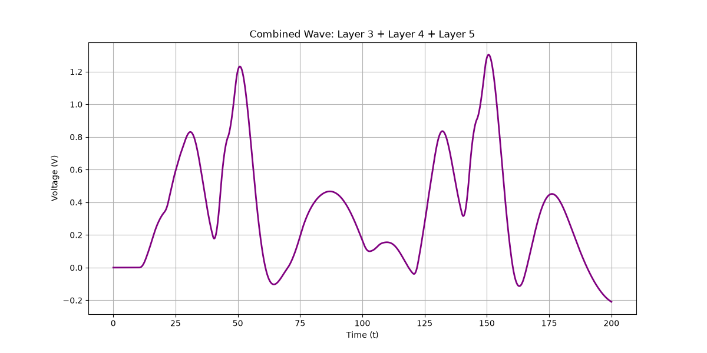
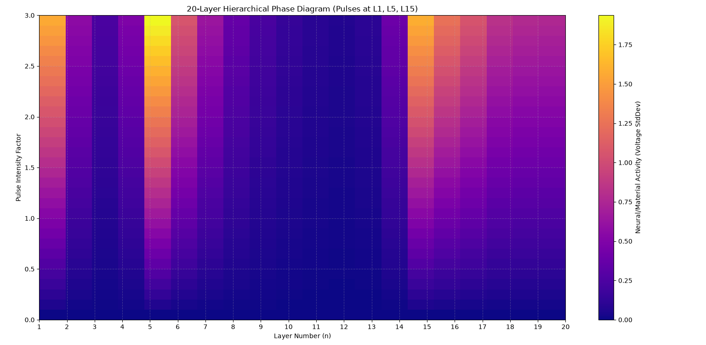

# Multi-Layer Complex Systems Toy Model

This repository contains a Python-based simulation framework for a **Multi-Layer Coupled Non-Linear Circuit System**, designed to model hierarchical information processing, bottom-up emergence, and top-down modulation inspired by complex systems and cognitive dynamics.

## 🌟 Overview

The model simulates a chain of $N$-layered RL/RC-like coupled circuits where:

* **Micro-level layers** (e.g., Layer 1–2) handle sharp, high-frequency local pulse inputs.
* **Mid-level layers** integrate and transform the dissipated energy from lower layers into contextual representations.
* **Macro-level top layers** (e.g., Layer 5 or 20) act as global wave generators that capture overall system trends.
* **Top-down feedback** is implemented dynamically—the state of the highest layer modulates the resistance/impedance of the lowest layer (e.g., $R_{1\_dynamic} = R_{1\_base} / (1 + \alpha V_{c, top})$), creating a non-linear adaptive loop.

---

## 📂 Key Features & Scripts

1. **5-Layer Toy Model (`5_layer_simulation.py`)**
* Multi-frequency pulse inputs across individual layers.
* Real-time visualization of micro-spikes evolving into smooth macro-waves.
* **Hierarchical Phase Diagram Generation**: A world-first-style phase map sweeping input intensity against layer depth to visualize energy propagation and dissipation across the hierarchy.


2. **20-Layer Scaled Model (`20_layer_simulation.py`)**
* Scaled-up deep architecture demonstrating deep-layer wave propagation and structural stability under high-dimensional coupling.


---

## 📊 Visualizations

* **Waveform Dynamics**: Tracks how sharp pulses at the input layer transform into fractal-like global macro-waves at the top layer.
* **Hierarchical Phase Diagrams (Heatmaps)**: Visualizes the voltage standard deviation (activity intensity) across layers as a function of input pulse strength.

---

## 🚀 Getting Started

### Prerequisites

Make sure you have Python installed along with the required scientific computing libraries:

```bash
pip install numpy scipy matplotlib

```

### Running the Simulation

```bash
python 5_layer_simulation.py
# or for the 20-layer scaled version
python 20_layer_simulation.py

```

---

## 🛠️ Core Mathematical Structure

For each layer $n$:


$$\frac{dq_n}{dt} = i_n$$

$$\frac{di_n}{dt} = \frac{1}{L_n} \left( -R_n i_n - V_{c,n} + K_{n-1,n}(V_{c,n-1} - V_{c,n}) - K_{n,n+1}(V_{c,n} - V_{c,n+1}) + \text{Dissipation Terms} + \text{Pulse}(t) \right)$$

---

## 📄 License

This project is open-source and intended for exploratory research into complex systems dynamics.
