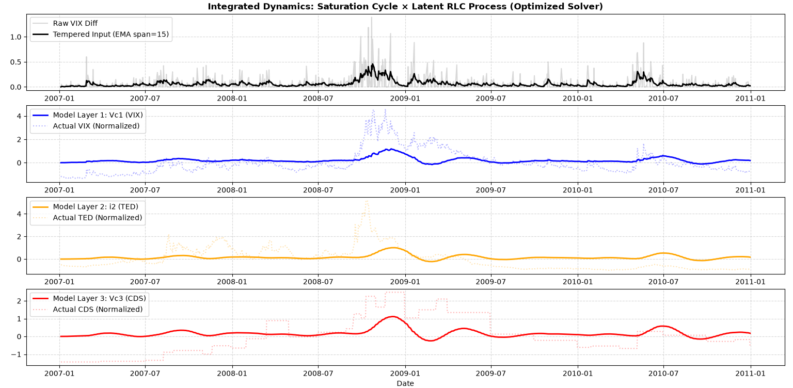
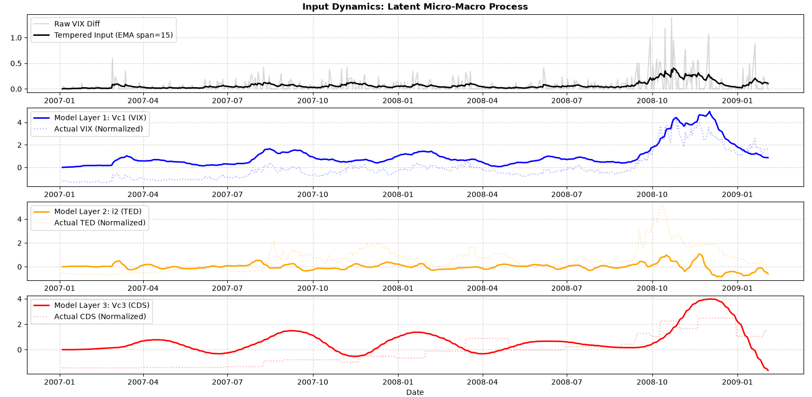

# General Theory of Hierarchical Generation: Financial Market Stress Propagation

This branch houses the pilot application of the **General Theory of Hierarchical Generation** to macroeconomic and financial market dynamics, focusing on systemic stress propagation during crises (specifically calibrated around the 2008 Lehman Shock era)[cite: 1].

## Overview

Traditional economic and financial models often treat market crashes as linear random walks or rely on statistical regressions (like VAR or GARCH) without accounting for structural limits or the emergence of abstract higher-level states. 

This model redefines financial systems through a physical and thermodynamic lens:
* **Multi-Layer RLC Structure**: Markets are modeled as layered circuits where variables (e.g., VIX, TED Spread, CDS) represent distinct conceptual tiers with specific inertias (capacitance/inductance) and damping (dissipation).
* **Saturation-Driven Dynamics**: Moving away from standard linear coupling, the system incorporates saturation thresholds ($S_{\mathrm{crit}}$) where approaching critical limits drives discontinuous transitions and cross-layer information flow[cite: 1].

---

## Repository Structure (`financial-model` branch)

* `models/` : Implementation of the non-linear saturation and RLC differential equation systems.
* `data/` : Historical market stress data (2007–2011 period).
* `notebooks/` : Simulation scripts utilizing robust numerical solvers (e.g., `RK45`, `Radau`) for time-series fitting.

---

## Core Theoretical Concept

1. **Dissipation as Information/Structure ($R_n$)**: Drawing from the broader hierarchical generation theory, structural degradation and loss at lower layers ($H_n$) sediment into actionable meaning or systemic shifts at higher layers ($H_{n+1}$)[cite: 1].
2. **Adaptive Feedback**: High-tier stress dynamics dynamically alter the conductive parameters (resistance) of lower tiers, modeling realistic systemic feedback loops.

## Future Outlook

This economic application serves as the first empirical proof of concept. Future expansions of this framework will explore hierarchical generation in other complex domains (e.g., cognitive architectures and organizational structures).

## 📈 Autonomous Self-Organization (Simulation Result)

**Author:** Independent Researcher  
**Full Abstract Paper:** Accessible via the Zenodo DOI badge above.
