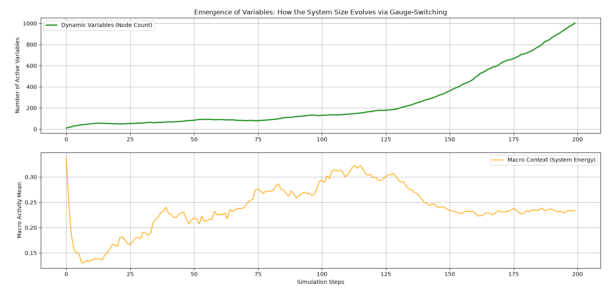

# Emergence of Variables via Gauge-Switching: Covariant Multiscale Dynamics

This project introduces a mathematical and physical simulation framework that embeds the concept of **"Gauge-Covariant Differentiation"**—derived from quantum field theory and particle physics—into a macro-micro interacting system to verify the emergent generation of novel hierarchical layers in complex systems.

Rather than relying on artificial, exogenous reset mechanisms, this system leverages a continuous **"Spatiotemporal Differentiation and Integration Cycle"** alongside a set of interactions analogous to **"The Four Fundamental Forces of Nature (including Phase-Transition Switching)"**. Through the tension of these elements, the system autonomously co-sustains macro-level focused states (hierarchical emergence) and micro-level 1/f fluctuations (self-organized criticality).

---

## 🌀 Core Concept 1: Hierarchical Emergence via Spatiotemporal Calculus Cycles

The dynamics of complex systems within this simulator are driven by an endless loop weaving together **[Spatial Integration, Spatial Differentiation, Temporal Differentiation, and Temporal Integration]**, giving rise to a bottom-up hierarchical emergence from micro-elements to macro-orders.

1. **Spatial Integration (Extraction of Macro Context)**
   By spatially aggregating the absolute activity values of individual micro-elements, the system extracts the "Macro Context" (the global average of system energy) that envelops the entire field.
2. **Self-Referential Feedback (Dynamic Sensitivity Modulation)**
   In response to the magnitude of this extracted Macro Context, the "reconciliation threshold (sensitivity)" of the gauge switches dynamically modulates via a sinusoidal function.
3. **Spatial Differentiation (Difference Calculus via Gauge-Switching)**
   The states of adjacent elements are calculated by taking their difference *after* parallel-transporting (rotating) them through their local, uniquely configured criteria (Gauge Switch \(W\)). This mathematically embeds the structural tension or "distortion of relationships" into the spatial derivative rather than computing a simple arithmetic difference.
4. **Temporal Integration (Cumulative State Updates)**
   The total sum of relational distortions computed via spatial differentiation accumulates over time (Temporal Integration), acting directly as the driving acceleration/force pushing the micro-elements into their next temporal states.

---

## ⚛️ Core Concept 2: Autonomous Variable Propagation and "The Four Fundamental Forces"

When the structural tension within the spatiotemporal calculus cycle reaches a critical limit, the system dynamically rewrites its own data architecture based on mechanics analogous to the fundamental interactions of particle physics.

* **The Weak Interaction & Phase-Transition Switching (Variable Multiplication Trigger)**
   The local friction of competing internal references acts as the weak force. The moment the spatial differentiation error surpasses the macro-configured threshold (`switch_threshold`), a **"Phase-Transition Switch (Spontaneous Symmetry Breaking)"** is triggered. To release the localized structural bottleneck and dissipation stress, the system decouples the old link and automatically spawns a **"new mediating variable (bypass node)"** via an autonomous cell-division process. This serves as the structural engine for hierarchical evolution.
* **Gravitational Interaction (Dissipation & Variable Pruning)**
   While the entire system is continuously subjected to baseline thermal jitter (micro-noise/differentiation), variables that become overly synchronized with their neighbors—causing their absolute activity to drop to zero—are automatically pruned (annihilated). This acts as a foundational stabilization force, shedding redundant energy and maintaining metabolic efficiency while preventing full systemic collapse.
* **Electromagnetic & Strong Interactions (Structural Cohesion & Wave Propagation)**
   Newly generated variables are seamlessly integrated into the network topology (e.g., ring topology) between the original nodes (\(i \rightarrow j\)). They function to maintain structural integrity against external dispersion while optimizing the propagation speed (`C_WAVE`) of information packets across the network.

---

## 📊 Interpretation of Simulation Results

Running the simulation script generates a two-tiered multiscale analysis visualization:

1. **Top Panel: Dynamic Variables (Node Count)**
   Visualizes the process of the system autonomously expanding its own capacity. Starting from an initial configuration of 10 nodes, it demonstrates how the system size scales up non-linearly and exponentially every time the micro-distortions break through the critical threshold.
2. **Bottom Panel: Macro Context (System Energy)**
   Tracks the global spatial mean of system activity. During phases of explosive variable growth (phase transition), the macro-level energy forms a well-regulated plateau with complex fluctuations, proving that the system self-tunes into a state of self-organized criticality.

---

## 🛠 Prerequisites & Dependencies

- Python 3.8+
- NumPy
- Matplotlib

---

## 🚀 Usage

Clone the repository and run the main script to initiate the spatiotemporal dynamic rewriting loop and visualize the self-propagating system dynamics.

```bash
python main.py
```

