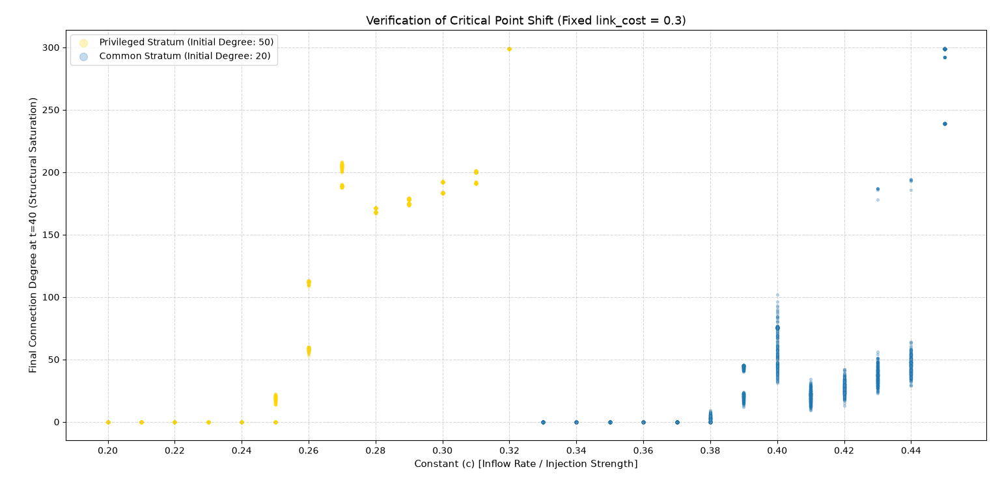

# Verification of Critical Point Shift & Asymmetric Stratum Bifurcation

This section houses the phase sweep analysis investigating the **General Theory of Hierarchical Generation** within a bounded, self-referential graph space (\(N=300\)). By pinning the structural deflation parameter (`link_cost = 0.30`) and sweeping the resource inflow rate (\(c\)), this simulation directly uncovers the topological phase boundaries where inequality, structural freezing (glassification), and sudden saturation catastrophes emerge.

## 📌 Theoretical Core & Multi-Domain Mapping

The model operates on a deceptively simple yet highly non-linear feedback loop: **Inflow (\(c \cdot \text{Degree}\))** feeds the node's activity buffer (`dynamic_quota`), while **Maintenance Drag (\(\text{cost} \cdot \text{Degree}\))** extracts it. When applied to finite physical or social structures, this base toy model acts as a universal mathematical prism for several macroscopic phenomena:

| Network Parameter | Macro-Economic Translation (Monetary Policy) | Socio-Cultural Translation (SNS Viral / Inflation Fluctuation) |
| :--- | :--- | :--- |
| **Initial Stratification (\(50\) vs \(20\))** | **Initial Capital Abundance** (Conglomerates vs Retail Agents) | **Initial Attention Potential** (Core Amplifiers vs Casual Bystanders) |
| **Inflow Rate (\(c\))** | **Monetary Easing / Injection Strength** (Liquidity Provision) | **Recommendation Algorithm Drive** (Impression Boost / Virality Intensity) |
| **Maintenance Cost (\(cost = 0.30\))** | **Central Bank Base Rate** (Cost of Capital Leverage) | **Attention Decay Rate** (Information Obsolescence / Consumer Boredom) |
| **Bifurcation Bands (Gold / Blue)** | **Socio-Economic Stratum Divergence** | **Echo-Chamber vs Mass-Market Segregation** |
| **Topological Saturation (Degree \(\to 299\))** | **Over-liquidity Bubble / Systemic Freeze** | **Total Information Saturation / "Owa-kon" State** |

---

## 🔍 Macro-Phasial Interpretations of the Sweep Plot

The generated bifurcation plot maps out a brutal, asymmetric timeline of systemic collapse and awakening across three distinct regimes:

### 1. The Austerity Death Phase (\(c \le 0.24\))
Below a critical threshold, the macroeconomic drag (\(cost=0.30\)) completely chokes the system. Neither the privileged stratum (Gold) nor the commoners (Blue) can generate enough liquidity to offset their maintenance liabilities. Every single node collapses into bankruptcy, freezing the graph into a completely isolated zero-density state (Systemic Depression).

### 2. The Entrenched Hegemony Phase (\(c = 0.25 \sim 0.37\))
As liquidity injection (\(c\)) edges up, **the Privileged Stratum abruptly awakens at \(c=0.25\)**, launching an exponential self-referential growth loop to monopolize structural connections (\(Degree \sim 170-200\)). Crucially, **the Common Stratum remains topologically dead (Degree = 0)** during this window. This provides a mathematical proof of *Trickle-Down Failure*: injecting liquidity under stiff maintenance costs exclusively hyper-inflates the dominant hubs, completely isolated from the lower tiers.

### 3. The Retail Influx Catastrophe & Structural Jamming (\(c \ge 0.38\))
* **The "Shoeshine Boy" Threshold (\(c \approx 0.38\)):** When ease intensifies, the common bystanders (Blue) finally break through the barrier and aggressively enter the network competition. 
* **The Volatility Explosion (\(c = 0.40\)):** At this precise critical point, the Blue band undergoes a massive structural divergence (surging from \(0\) to \(100\) in degree). This represents the peak of market speculation or a rampant viral internet scandal, where hyper-active stochastic link-swapping triggers profound volatility.
* **The Saturation Freeze (\(c \ge 0.44\)):** Pushing injection further forces the entire network into a topological bottleneck. The finite room (\(N=300\)) fills up completely; there are no unlinked nodes left to absorb the excess energy. The network undergoes a **Topological Jamming Transition (Glassification)**, instantly killing liquidity and freezing the network into an immobile, over-saturated dead end.

---

## ⚙️ Mathematical Novelty of the Toy Model

Traditional models (like the Barabási-Albert model) assume an infinite frontier where the pie expands indefinitely, allowing smooth power-law growth. 

In contrast, this project proves that in a **closed, finite universe**, forcing expansion past structural limits through self-referential feedback triggers **abrupt, discontinuous phase boundaries**. By enforcing a strict binary stratification at \(t=0\), we bypass stochastic noise and capture the pure, geometric inevitability of systemic stratification, bubble explosion, and ultimate topological suffocation.

Feel free to fork, experiment with parameters (e.g., `input_energy`, `grad_weight`), and explore the boundaries where this beautiful order collapses into chaos or shifts into higher dimensions.

---
**Author:** Independent Researcher  
**Full Abstract Paper:** Accessible via the Zenodo DOI badge above.
