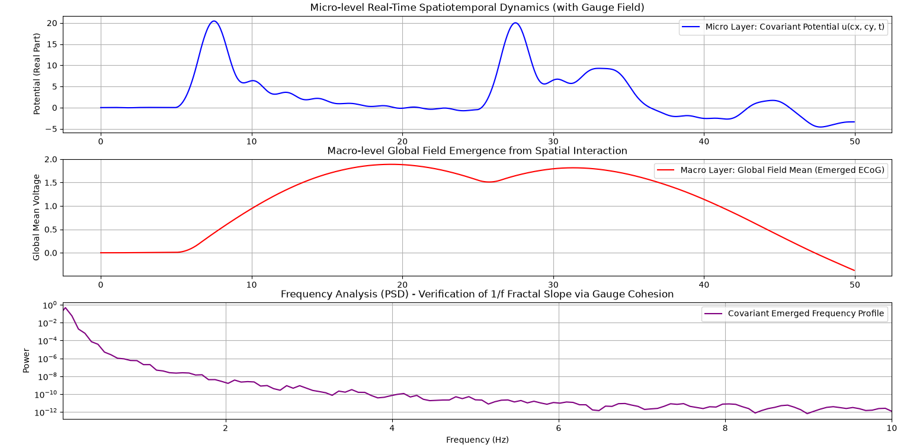

# Gauge-Covariant Multiscale Dynamics: Hierarchical Generation Framework in Complex Systems

This project is a mathematical physics simulator that integrates **gauge covariant differentiation** from quantum field physics into macro-micro interacting systems to study emergent hierarchies [1]. 

The system autonomously balances **macro-level focused states** and **1/f fluctuations** through a continuous **spatiotemporal derivative/integration cycle** and **four natural force analogs**, without exogenous resets [1].

---

## 🌀 Core Concept 1: Spatiotemporal Derivative & Integration Cycles

Driven by an endless loop of spatial and temporal derivatives and integrations, the system bridges microscopic elements and macroscopic order [1]. The cycle flows from spatial derivatives (generating time-derivative forces/acceleration) to time integration (accumulating states), spatial integration (forming global macro-contexts), and back through a self-referential spatial derivative loop [1].

---

## ⚛️ Core Concept 2: The Four Fundamental Forces & Phase-Transition Switching

To maintain a self-sustaining system, mathematical analogs of four physical forces are embedded:
* **Electromagnetism (`C_WAVE`):** Propels spatial derivatives into acceleration for fast information transmission [1].
* **Strong Force (`ALPHA`):** Clamps macro waves and micro elements to resist dissipation and maintain focused states [1].
* **Weak Force (`G_COUPLING`):** Manages local phase tensions and acts as a non-linear phase-transition switch (via `np.sin(macro_context)`), triggering traffic bottlenecks to prevent hyper-synchronization and initiate resets [1].
* **Gravity (`DAMPING` / `noise`):** Dissipates excess energy to the baseline while introducing noise to seed future emergences [1].

---

## 📊 Interpretation of Simulation Results

1. **Micro Layer:** Real-time covariant potential evolution showing pulse-driven structure generation and spontaneous fluctuations [1].
2. **Macro Layer:** Emergent global wave field displaying sustained focused plateaus followed by autonomous resets [1].
3. **Frequency Analysis (PSD):** Log-log scale verification of a **1/f fractal slope** indicating self-organized criticality [1].

---

## 🛠 Prerequisites & Dependencies

- Python 3.8+
- NumPy
- Matplotlib
- SciPy

---

## 🚀 Getting Started

```bash
git clone https://github.com
cd gauge-covariant-multiscale-dynamics
python main.py
```
