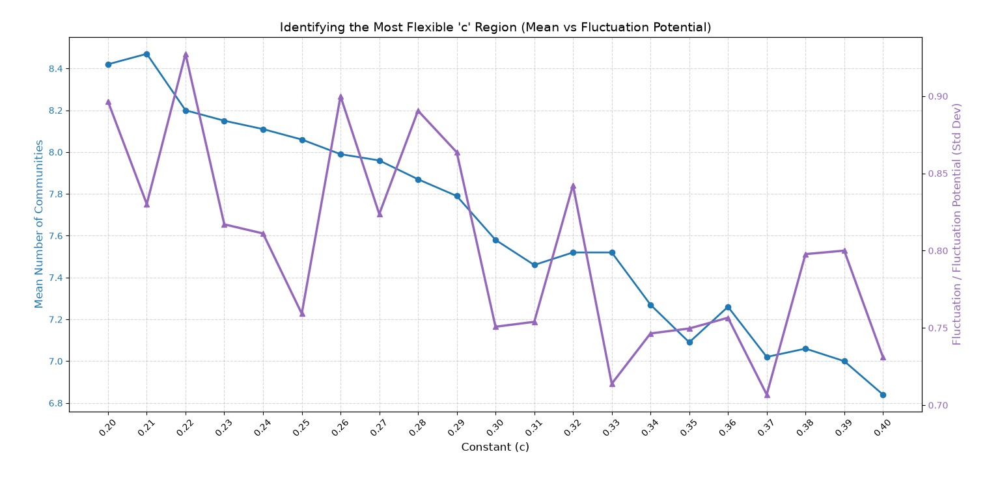

# 🌀 Axiomatic-Hierarchical-Generation (W-S-T Uroboros Model)

[](https://doi.org/10.5281/zenodo.22151319)

A minimal numerical realization of the **General Theory of Hierarchical Generation**. This repository contains the source code for the **W-S-T (Wave-Space-Time) Closed-Loop Gradient Model**, demonstrating self-referential emergence and autonomous scale-expansion.

> **"Calculus is not just a horizontal tool for continuous spaces; it is a vertical elevator for shifting across distinct hierarchical dimensions."**

---

## 📈 Autonomous Self-Organization (Simulation Result)



# Network Evolution Dynamics: Self-Referential Growth and Multistable Fluctuations

This repository contains the numerical verification model for the companion paper of the **"General Theory of Hierarchical Generation" (Muramoto, 2026)**. 

The simulation explores how a minimal self-referential growth rule ($quota = c \cdot Degree$) in a closed graph space triggers discrete macroscopic topological phase transitions, emergent multi-stability, and structured fluctuation profiles.

## 🌟 Overview & Core Insights

Traditional network science (e.g., the Barabási–Albert model) often relies on open systems (node influx) and statistical averaging to explain hub formation, treating microscopic fluctuations as mere noise to be eliminated. 

In contrast, this project uncovers a profound paradigm: **Macroscopic topological fluctuations (wave-like multi-stability) are not random errors, but a structural necessity for information retention ("memory pockets")** born from the collision between continuous growth dynamics and discrete graph space.

---

## 🔬 Core Hypotheses & Perspectives

### 1. Complex Systems Perspective (Macroscopic Phase Dynamics)
* **The Fluctuation as a Function**: The wave-like behavior of the community counts implies that the system does not settle into a single rigid topology. Instead, it maintains **multi-stability**, allowing it to host diverse structural states under identical macro-parameters.
* **Semantic Sedimentation**: These fluctuating valleys act as "memory pockets." The resilience of the fluctuation profile under ensemble averaging directly physically verifies the concept of *Dissipation Accumulation* introduced in the general theory.

### 2. Network Theory Perspective (Topological Congestion)
* **Finite System Size Clash**: The peak of fluctuation potential (Standard Deviation) represents a deterministic congestion phase. It occurs precisely when the rapid growth of hub nodes collides with the hard geometric boundary of the system size ($N=300$).
* **Intrinsic Scale Constraint**: The functional form of growthポテンシャル (e.g., Linear vs. Sqrt) algebraically constrains the specific parameter region ($c$) where the system achieves maximum flexibility.

---

## 📊 Key Findings

By sweeping the scale coefficient $c$ from `0.20` to `0.40` over **100 independent random seeds (Ensemble Averaging)**, the simulation reveals an extraordinary dual-axis profile:

1. **Mean Community Count (Blue)**: Shows a non-monotonic, multi-peaked wave instead of a smooth monotonic decay, indicating discrete structural reconfiguration regions.
2. **Fluctuation Potential / Std Dev (Purple)**: Exhibits a sharp global peak around $c=0.22$, followed by localized multi-resonance spikes (e.g., $c=0.26, 0.28, 0.32$). This proves that the system's structural flexibility is maximized at specific intrinsic scales dictated by its self-referential function form.

---

## 💻 Getting Started

### Dependencies
Ensure you have the following Python libraries installed:
```bash
pip install numpy matplotlib networkx
```

### Usage
Run the fine-sweep analysis script to generate the Mean vs. Fluctuation Potential plot:
```bash
python network_fluctuation_sweep.py
```

---

## 📜 Citation & Theoretical Foundation

This numerical implementation directly grounds the abstract operator algebra defined in:

> **Muramoto, R. (2026).** *General Theory of Hierarchical Generation.*
> * **Axiom 1 & 2**: Self-referential scale-derivative operators ($quota = c \cdot H_n$).
> * **Axiom 4**: Critical Discontinuity and phase-transition-like activation when the intrinsic scale approaches the system's saturation boundary ($S_n \to S_{crit}$).

---
*Developed by Ryo Muramoto. Exploring the self-organizing geometry of complex systems.*


Feel free to fork, experiment with parameters (e.g., `input_energy`, `grad_weight`), and explore the boundaries where this beautiful order collapses into chaos or shifts into higher dimensions.

---
**Author:** Independent Researcher  
**Full Abstract Paper:** Accessible via the Zenodo DOI badge above.
