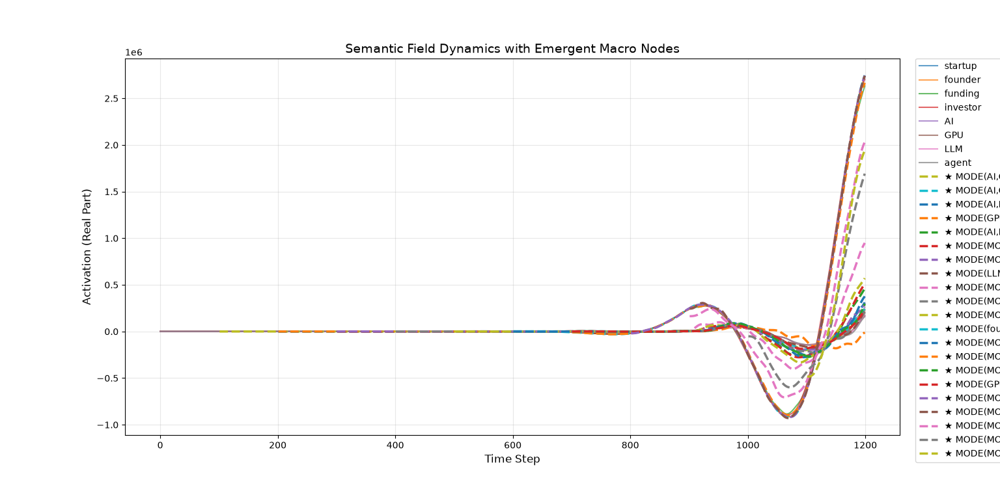

Semantic Field Dynamics (Prototype)

This repository features a prototype simulation that explores wave propagation over a semantic network, combined with the autonomous emergence of macro-level concepts.
💡 Core Mechanics
1. Gauge Laplacian Wave Dynamics
Nodes interact via wave propagation (complex numbers). Instead of simple diffusion, transmission is modulated by a phase factor (Gauge Field) on each edge, causing dynamic wave interference.
2. Autonomous Mode Discovery
Every 100 steps, the system computes the covariance matrix of recent node activations. Groups showing high synchronization are captured via eigendecomposition and automatically injected back into the network as Level-1 Macro Nodes (e.g., MODE(AI,GPU,LLM,agent)).
3. Top-Down Feedback Loop
Newly emerged macro nodes connect back to their members. Stronger synchronized groups apply higher tension (inertia), dynamically rewriting how waves propagate across the entire semantic field.
