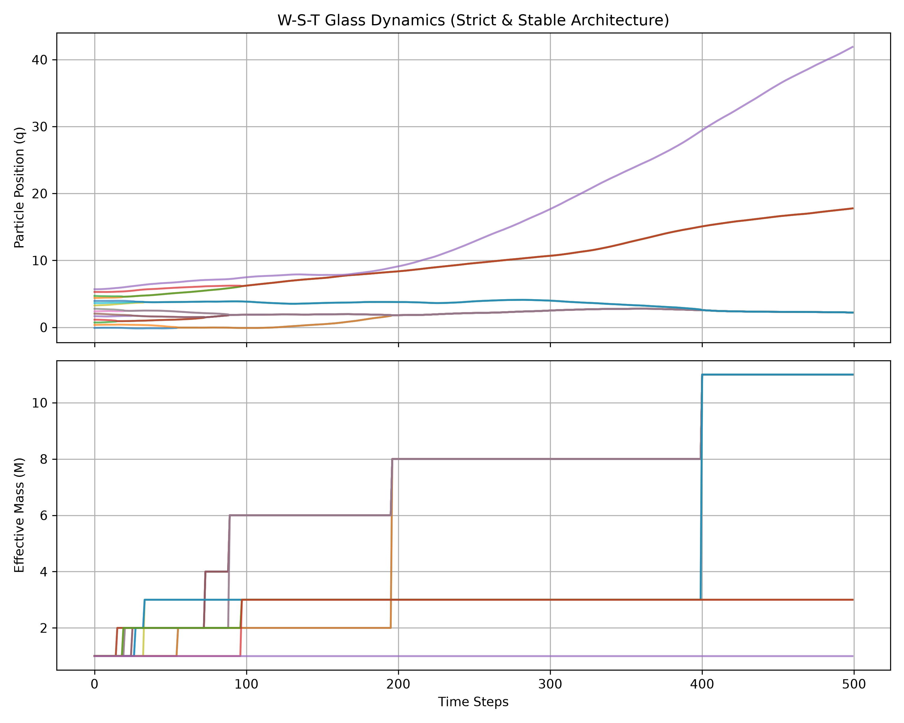

🧠 Theoretical Framework & Mathematical Background
This model numerically realizes a core General System Theory principle: discarded residues from differentiation act as integration constants that retroactively redefine macro-level rules. Streamlined into a 1D toy model of multi-body collisions, it explores Post-Hoc Variable Emergence and boundary breaches. Calculus & Emergence: Micro-level residues collide with macro-boundary conditions via integration (\[q\]). Boundary breaches trigger new variables and cross-coupling (entanglement), exploding system complexity. Boundaries & Phase Transitions: Boundaries function as coarse-grained zones, mirroring chemical neutralization titrations where macro-property shifts (like pH) are determined retroactively.

🚊 Physical Metaphor: Glassification via Crowded TrainsGlass sits between liquid and solid. This model uses packed train car dynamics to illustrate how localized clusters form and freeze. Driven by momentum conservation via a UnionFind data structure, close variables cross boundaries, pool aggregate inertia, and freeze irreversibly. 

📊 Simulation Analytics: Potential-Free Phase TransitionsRunning wst_simulation.py demonstrates: Upper Plot (Particle Position \[q\]): Particles converge into localized strands/bundles rather than a single crystal, capturing a glass-state freeze. Lower Plot (Effective Mass \[M\]): Discontinuous step-wise increases (1 ➔ 2 ➔ 4 ➔ 8) simulate the emergence of inertia. Crucially, this model operates potential-free—freezing emerges autonomously from topological and dynamic rules without pre-configured Lennard-Jones potentials. 

🚀 Future HorizonsFuture extensions include 2D/3D dimensionality expansion for geometric frustration, finite coefficients of restitution (\(e > 0\)) for reversible cross-coupling, and integration into cosmological or neural network architectures.

Feel free to fork, experiment with parameters (e.g., `input_energy`, `grad_weight`), and explore the boundaries where this beautiful order collapses into chaos or shifts into higher dimensions.

